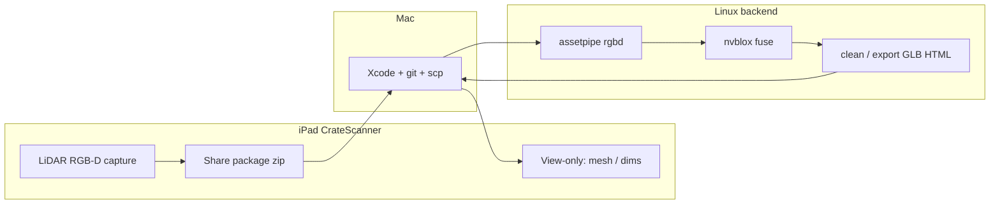

# Engin170 / CrateScanner full workflow

**Constant reference for Mac + iPad + Linux.**

iPad captures LiDAR RGB-D. **All heavy compute runs on Linux.**  
iPad only **views** finished outputs (mesh / dims) — it is not the reconstructor.

```text
┌──────────────────────────────────────────────────────────────────────────┐
│  IPAD (CrateScanner / Xcode) — capture + view-only                       │
│  · LiDAR + RGB + pose  (Engin170 / E170 app)                             │
│  · Share package when scan finishes                                      │
│  · Later: show Linux results (orbit mesh / L×W×H) — no nvblox on device  │
└────────────────────────────┬───────────────────────────▲─────────────────┘
                             │ upload zip                │ download result
                             ▼                           │
┌──────────────────────────────────────────────────────────────────────────┐
│  MAC — Xcode build, git, file shuttle                                    │
│  · Clone/pull 3dasset + open CrateScanner                                │
│  · AirDrop / scp between iPad ↔ Linux                                    │
└────────────────────────────┬───────────────────────────▲─────────────────┘
                             │ scp session zip           │ scp mesh/viewer
                             ▼                           │
┌──────────────────────────────────────────────────────────────────────────┐
│  LINUX (4080) — BACKEND (all compute finishes here)                      │
│  · assetpipe rgbd → nvblox (Open3D TSDF only if nvblox broken)           │
│  · clean / optional texture / optional TRELLIS                           │
│  · outputs: ply, glb, scan_view.html, dims                               │
└──────────────────────────────────────────────────────────────────────────┘
```

---

## 1. Repos to clone (Mac)

### A. Pipeline + packaged app (always pull this)

```bash
git clone https://github.com/jayahn17/3dasset.git
cd 3dasset
git checkout claude/3d-asset-recording-quest-e1jvtx
git pull
```

| Path | What |
|------|------|
| `mobile/CrateScannerApp/` | Full iOS sources (RGB-D export + share package) |
| `docs/MAC_IPAD_NVBLOX.md` | Short daily Mac checklist |
| **`docs/ENGIN170_WORKFLOW.md`** | **This file — full loop** |
| `assetpipe rgbd` | Linux fuse CLI |

### B. Original Engin170 / client app repo (history / signing)

```bash
git clone https://github.com/NathanJim17/E170_Client_Project.git
```

Use **`3dasset/mobile/CrateScannerApp/`** as the source of truth for the
pipeline-wired app (SessionExporter + PackageExporter). Merge those files into
your Xcode project if you already opened `E170_Client_Project`.

---

## 2. Roles (who does what)

| Machine | Does | Does **not** |
|---------|------|----------------|
| **iPad** | LiDAR scan, record RGB-D, share zip, **view** final mesh/dims | Run nvblox / Open3D / TRELLIS |
| **Mac** | Xcode build, git, AirDrop/scp | Heavy fuse (optional only for tiny tests) |
| **Linux** | **All compute:** nvblox fuse, clean, mesh export, optional texture/gen | Capture LiDAR |

**Backend = Linux.** iPad is camera + lightbox for results.

---

## 3. End-to-end steps

### Step 1 — Mac: build app onto iPad

The `.xcodeproj` is generated (gitignored), so regenerate after every pull:

```bash
cd ~/3dasset && git pull
cd mobile/CrateScannerApp
xcodegen generate            # brew install xcodegen — once
open CrateScanner.xcodeproj
# Signing & Capabilities → Team = your Apple ID
# Destination = iPad (LiDAR) → ⌘R
```

Regenerating is what pulls newly added Swift files into the app target. Details:
[../mobile/CrateScannerApp/README.md](../mobile/CrateScannerApp/README.md)

### Step 2 — iPad: capture

1. Aim at the object → **Start Scan**  
2. Slow orbit (watch the **RGB-D** count rise) — Measure/box is optional  
3. **Finish Scan**  
4. On review: if a Google Drive folder is set, the package **auto-saves** there
   (Drive uploads it). First time, tap **Choose** and pick the folder once.  

Package:

```text
CrateScan-<id>.zip
  measurement.json      # inch dims from on-device LiDAR mesh
  mesh.obj              # quick on-device mesh (optional Path A)
  session/              # ← what Linux nvblox needs
    manifest.json
    images/*.jpg          # color frames (manifest keys them "color")
    depth/*.png
```

This is **not** a normal Camera video. It is a **frame sequence with depth + pose**.

### Step 3 — iPad → Linux: send input

Every scan is kept on the iPad at **Files → On My iPad → CrateScanner →
CrateScans/Packages** (persistent, survives restarts), so you can transfer it
later — not only from the share sheet at capture time.

```bash
# Route A — Drive: drag the zip into Google Drive in Files, then on Linux
rclone copy gdrive:CrateScans ~/3dasset/captures/

# Route B — AirDrop to Mac, then
scp ~/Downloads/CrateScan-XXXXXXXX.zip USER@LINUX_IP:~/3dasset/captures/
```

### Step 4 — Linux: compute (backend)

```bash
conda activate assetpipe
cd ~/3dasset
unzip -o captures/CrateScan-XXXXXXXX.zip -d captures/scan1

# one-shot launcher (prefers nvblox)
bash scripts/launch_rgbd_fuse.sh captures/scan1 demo_out/ipad_scan1

# or watch folder for new iPad zips
# bash scripts/watch_ipad_captures.sh
```

Open-source dry-run (no iPad): see **[RGBD_LAUNCH.md](RGBD_LAUNCH.md)**.

Outputs (examples):

```text
demo_out/ipad_scan1/
  scene.ply
  scene_tsdf_mesh.ply
  scene_clean.ply          # if clean enabled
  scene_mesh.glb
  scan_view.html           # open in browser
  rgbd_meta.json
```

Optional later on Linux: texture (OpenMVS) / TRELLIS fill — still **on Linux**.

### Step 5 — Linux → iPad: output for **view only**

Until the app has a “Results” download screen, use file share:

```bash
# On Linux — pack viewables
cd ~/3dasset/demo_out/ipad_scan1
zip -r ~/3dasset/captures/ipad_scan1_RESULT.zip \
  scene_mesh.glb scene_tsdf_mesh.ply scan_view.html rgbd_meta.json

# On Mac
scp USER@LINUX_IP:~/3dasset/captures/ipad_scan1_RESULT.zip ~/Downloads/
# AirDrop RESULT zip to iPad → Files
# Or open scan_view.html / GLB on Mac and screen-share to iPad for now
```

**View-only on iPad means:** orbit / check dims — **do not** re-run reconstruct on device.

**Roadmap (app):** “Fetch result” button that downloads `scene_mesh.glb` + dims JSON from Linux API and shows the existing review viewer. Capture stays on-device; compute stays on Linux.

---

## 4. Workflow diagram (mermaid)



---

## 5. What “finished” means

| Stage | Done when |
|-------|-----------|
| iPad capture | Zip has `session/manifest.json` + color + depth; RGB-D count &gt; 0 |
| Linux compute | `demo_out/.../scene_tsdf_mesh.ply` (or glb) exists; viewer opens |
| iPad view | User can see mesh / dims from Linux output (AirDrop or future in-app fetch) |

---

## 6. Not in this workflow

- Old `images/Chest` HEICs / RGB-only albums  
- COLMAP as the primary reconstructor for crates  
- Running nvblox on the iPad  
- Treating Open3D as the product backend (fallback only)

---

## 7. Quick command card

**Mac pull**
```bash
cd ~/3dasset && git pull
```

**Linux fuse**
```bash
python -m assetpipe rgbd captures/scan1/session --backend nvblox --out demo_out/ipad_scan1
```

**Linux pack result for iPad**
```bash
zip -r captures/RESULT.zip demo_out/ipad_scan1/scene_mesh.glb \
  demo_out/ipad_scan1/scan_view.html demo_out/ipad_scan1/rgbd_meta.json
```

---

## 8. Related docs

| Doc | Use |
|-----|-----|
| **[MAC_IPAD_NVBLOX.md](MAC_IPAD_NVBLOX.md)** | Short daily Mac checklist |
| [CRATESCANNER_BRIDGE.md](CRATESCANNER_BRIDGE.md) | App ↔ assetpipe details |
| [NVBLOX_WORKFLOW.md](NVBLOX_WORKFLOW.md) | Server fuse / install |
| [DUAL_MACHINE_PLAYBOOK.md](DUAL_MACHINE_PLAYBOOK.md) | Extra dual-machine notes |
| [mobile/CrateScannerApp/README.md](../mobile/CrateScannerApp/README.md) | Xcode package |
