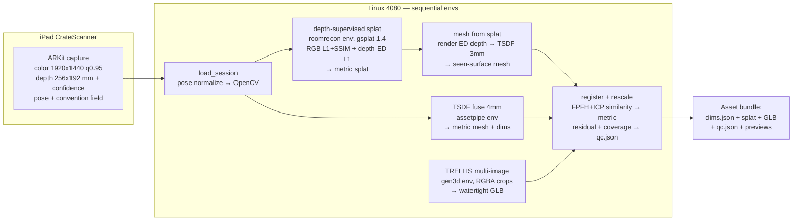

# Object Asset Plan — iPad RGB-D → Kiri-class metric assets (open source)

**Status:** approved direction (2026-07-24). **Progress 2026-07-24:** Phase 0 SHIPPED
(convention fix + regression test; voxel auto-select 4mm/1cm; EWA renderer wired into
asset_from_scan; daemon auto room/object mode) — validated on two new Drive sessions
(apartment sweep: sea-urchin → legible floor plan; loop drift measured 3.4 cm).
Phase 3.5 SHIPPED as MVP (`assetpipe sim-export`: CoACD colliders + trimesh
mass/COM/inertia + URDF/MJCF/SimReady-style USD; mouse GLB drops & settles in MuJoCo).
3DGUT re-run BLOCKED: NVIDIA kernel module 580.159 vs userspace 580.173 mismatch —
GPU dead until reboot. Gotcha: import pxr BEFORE coacd (segfault otherwise).

Target: clean, **metric**, catalog-ready
object assets (GLB/USD) from CrateScanner iPad RGB-D, matching Kiri Engine object-scan
quality with a permissive-license open-source stack. World Labs Marble is explicitly
*not* the reconstruction benchmark (generative world model, non-metric — different
category); we borrow only its trick — generative completion — for surfaces the camera
never saw, anchored to measured geometry.

This plan supersedes the bottleneck ranking in the 2026-07-24 evaluation: a
**pose-convention bug** found during re-planning outranks everything and reorders the
phases.

---

## 0. The critical finding: ARKit↔OpenCV pose convention bug

**Every iPad fuse to date has been geometrically inconsistent.**

- `SessionExporter.swift` writes raw `frame.camera.transform` — ARKit/OpenGL camera
  convention (**+y up, −z forward**), row-major, with `source: "cratescanner"`.
- Every consumer assumes OpenCV/COLMAP (**+y down, +z forward**): Open3D
  `integrate` ([nvblox_fuse.py:134](../assetpipe/scene/nvblox_fuse.py)), the COLMAP
  export + depth seeding ([run_3dgut_from_session.py:113-139](../tools/run_3dgut_from_session.py)),
  and the ICP pose-init `T_pose = inv(c2w_0) @ c2w_i`
  ([rgbd_object_asset.py:398-408](../assetpipe/scene/rgbd_object_asset.py)).
- Required correction: `c2w_opencv = c2w_arkit @ diag(1,-1,-1,1)`.

**Empirical proof** (CrateScan-1E4E971C, 20 frames spanning 56° rotation): with the flip,
fusion tightens 949→688 occupied vox/1k pts and **32.8%** of points land on one 8 mm
plane **1.3°** from gravity (the table). Without it: 7.8% inliers, 8.6° off, and
misalignment between frames grows as **2× relative yaw/roll angle** — 80–112° of shell
rotation for this orbit, i.e. ~1 m surface displacement vs the 4 cm TSDF truncation.
Frames don't reinforce, they carve each other. This — not missing depth supervision —
is the primary cause of the spiky 3DGUT needle-cloud, and why only the Open3D
Lounge/Redwood demos (already OpenCV) looked right. It also explains the
"Pose init often fails under ARKit drift" comment in `rgbd_object_asset.py` — that
wasn't drift.

**Fix design** (verified against all consumers; one choke point):

1. `rgbd_session.py::load_session` — normalize poses to OpenCV at load:
   `conv = man.get("pose_convention") or ("arkit_gl" if man.get("source") == "cratescanner" else "opencv")`;
   if `arkit_gl`, right-multiply each pose by `diag(1,-1,-1,1)`. Store the resolved
   convention on `RgbdSession`. **All downstream consumers become correct with zero
   changes** (they all go through `load_session`).
2. `rgbd_curate.py` manifest writer — must emit `"pose_convention": "opencv"`
   (it re-serializes *loaded* poses and currently **drops `source`** — the trap).
3. `SessionExporter.swift` — additively emit `"pose_convention": "arkit_gl"`
   (self-describing; old zips still work via the `source` fallback).
4. `scripts/rgbd_session_from_open3d.py` — emit `"pose_convention": "opencv"`.
5. Regression test: synthetic 2-frame session, both conventions, assert cross-frame
   fusion agreement.

**Invalidated artifacts** (rebuild after fix): all `demo_out/CrateScan-*` TSDF fuses,
multi-frame ICP-merged object assets, curated-session manifests (patch in
`pose_convention`), and their `*_RESULT.zip`s. Unaffected: opensource demos,
single-frame assets, mesh-ingest/measure outputs (pose-free), pycolmap-SfM splats
(poses solved from pixels).

---

## 1. Architecture

**The asset bundle contract** — every scan produces:

| Artifact | Source | Role |
|---|---|---|
| `dims.json` / `measurement.txt` | on-device mesh + TSDF cross-check | **measurement truth** (0.25″ quantized) |
| `object_splat.ply` | depth-supervised gsplat | photoreal viewer asset, metric |
| `object_mesh.glb` | TRELLIS completion, ICP-registered + rescaled | watertight catalog visual, metric |
| `qc.json` | registration residual, held-out depth-L1, **observed-coverage fraction** | honesty gate — how much is measured vs hallucinated |
| previews / `scan_view.html` | existing viewer | review |

Key stance: the *measured* mesh is the truth for dimensions; the *generated* GLB is the
visual. The QC gate (ICP residual + coverage fraction) is the differentiator no
closed pipeline exposes.

**Depth-supervised splat: custom trainer, not DN-Splatter** (decision reversed from the
evaluation after pin-checking): DN-Splatter is Apache-2.0 and purpose-built for this,
but it's dormant (one commit in 2025) and pins `nerfstudio==1.1.3` + `gsplat==1.0.0`,
which would require yet another fragile env. Meanwhile roomrecon's **gsplat 1.4.0
natively renders expected depth** (`render_mode="RGB+ED"`, depth = last channel,
`viewmats` = OpenCV w2c — verified in the installed source). A ~400-line standalone
trainer (same cross-env driver pattern as `_splat_driver.py`) gives: dense init from
back-projected sensor depth, RGB L1+SSIM + λ·L1(rendered-ED vs sensor depth, valid
mask), opacity/scale regularizers, optional learnable SE3 pose deltas (drift polish),
splat PLY export. Normal regularization can be added later from depth-derived normals.
DN-Splatter stays on the shelf as an A/B baseline in a throwaway env if our trainer
underperforms.

Convention rules for writers (this is where the bug must not resurface):
- **COLMAP text / Open3D / gsplat viewmats:** OpenCV w2c → use normalized poses, invert.
- **nerfstudio `transforms.json`:** OpenGL c2w → raw ARKit pose is *already correct*;
  from a normalized (OpenCV) pose, un-flip: `c2w_gl = c2w_cv @ diag(1,-1,-1,1)`.

---

## 2. Phases

### Phase 0 — Correctness on existing data (same day; assetpipe env; no new deps)
1. Ship the convention fix (§0, items 1-5).
2. TSDF voxel 10 mm → **4 mm** for object-scale sessions (sensor resolves ~2.6 mm at
   the 0.55 m median range; auto-select by fused extent).
3. Re-fuse all CrateScan sessions; regenerate crops, dims, RESULT zips.
4. Re-run 3DGUT smoke at 30k iters, `every=2` (inherits the fix via `load_session`).
5. Wire the EWA gaussian renderer (`splat.py::render_gaussian_views`) into the
   PLY→generate path, replacing point-dot `render_orbit_views`; fix the
   `(0.3,0.3,0.3)` dims placeholder in `reconstruct/trellis.py`.

**Accept:** table-plane inliers jump ≥3× on re-fuse; 3DGUT preview is an object, not
needles; dims still within 0.25″ of on-device measurement.

### Phase 1 — Appearance unlock (app; one Xcode cycle)
- `maxColorWidth` 640 → **1920**; JPEG q 0.85 → 0.95 (or HEIC). ~10× session size
  (~30→~300 MB) — fine for Drive/scp.
- Emit `pose_convention`, and the ARKit `confidenceMap` alongside depth.
- Capture protocol doc: full 360° azimuth + one high pass; tabletop objects get a
  flip-and-rescan pass for the underside if a closed metric asset is required.

**Accept:** new session manifest self-describes; 1920 frames land on Linux; fuse
unchanged (TSDF still reads depth-res color by design).

### Phase 2 — Depth-supervised splat (linux; roomrecon env; runs on existing 640px data first)
- `tools/session_to_splat_dataset.py` — session → images/poses/depth arrays, both
  conventions explicit.
- `tools/train_rgbd_splat.py` — the custom gsplat trainer described in §1, driven
  cross-env like `_splat_driver.py`.
- Mesh extraction: render ED depth at training views from the trained splat → Open3D
  TSDF at 3 mm → mesh → existing crop/measure. (This is DN-Splatter's `o3dtsdf`
  recipe, ~60 lines.)

**Accept (A/B vs Phase-0 3DGUT and raw TSDF):** held-out depth-L1 median < 8 mm;
held-out PSNR ≥ 3DGUT baseline; fewer floaters (gaussians outside 1.2× object AABB);
mesh Chamfer vs TSDF reference; visual side-by-side.

### Phase 3 — Watertight metric asset (gen3d env)
- Foreground isolation (existing RANSAC-plane + density-peak — **not** a naive depth
  threshold) → RGBA crops of the top-K angularly-diverse frames (real photos; RGBA
  skips TRELLIS's rembg) + EWA splat renders as backup views.
- `TRELLIS run_multi_image` (multidiffusion mode; 16 GB is exactly the floor — run
  headless, `ATTN_BACKEND=xformers`, `SPCONV_ALGO=native`, restrict output formats).
- Register generated GLB to the metric object cloud: FPFH global + point-to-plane ICP
  **similarity** transform → rotation + uniform scale (report per-axis residual — 
  TRELLIS doesn't preserve aspect ratio; dims truth stays with the measured mesh).
- `qc.json`: ICP residual, coverage fraction (mesh faces within τ of measured cloud).

**Accept:** watertight GLB at real-world scale (uniform-scale error vs dims < 5%);
qc.json present; visibly object-shaped from all angles including unseen faces.

### Phase 2.5 — Object isolation (NEW, from the 2026-07-24 scorecard: the #1 object-track blocker)
The radius/focus crop heuristic failed on ALL real sessions — it keeps carpet slabs,
tripod legs, and desk clutter instead of the scanned object (1B38880A "object" =
0.54 m carpet+tripod crop; measurement.txt then quoted the SCENE mesh as the object:
a bottle reported as 131×100.5×18.75 in — the metric moat misreported at the report
layer). Fixes, in order:
1. **Mask-based isolation**: segment the object in 2-4 sharp frames (SAM 2 already
   in-env from room-sweep; or a capture-UI tap prompt), project masks through depth
   → 3D crop. Replaces the radius heuristic everywhere.
2. **Measurement source selection**: `measure.py` must quote object dims from the
   *isolated* geometry (or the app's box fit), never the raw on-device scene mesh.
3. **Sim-export scale lock**: pipe dims.json / bench best_uniform_scale into
   `sim-export` automatically instead of a manual --target-size (mouse shipped +34%
   wide from the unwired path; per-axis residual must be reported — TRELLIS distorts
   aspect ratios ~12-17% per axis on current inputs).

### Phase 3.5 — Sim export (Lightwheel-class rigid props; ~300-600 LOC, no new envs beyond pips)
Turn the asset bundle into a **SimReady USD + URDF + MJCF** so scanned objects drop into
Isaac Lab / MuJoCo / Genesis. Lightwheel's bar is not the mesh — it's the post-mesh layer:
collision geometry, physics params, USD structure, behavioral validation. For rigid props
that layer is fully open source:

- `pip install coacd` (MIT) — convex decomposition for collision meshes (V-HACD is
  deprecated; CoACD is what Genesis/obj2mjcf use).
- trimesh (already in env): watertight check → density-prior × volume → true mass, COM,
  full inertia tensor (replaces urdf.py's bbox-cuboid approximation). Keep a per-asset
  mass override — vision cannot weigh objects; density priors are honestly ±2×.
- usd-core (proven on this box in the 3dgrut env): author Z-up metric stage,
  `RigidBodyAPI` + `MeshCollisionAPI(convexDecomposition)` + `MassAPI` + friction
  material + Wikidata-QCode semantic label — targeting the **SimReady Foundation**
  `Prop-Robotics-Neutral/PhysX` profile (NVIDIA's spec + validator, Apache-2.0:
  github.com/NVIDIA/simready-foundation). GLB→USD textures via headless Blender.
- Validate: `python -m simready.foundation.core asset.usda` + load test in the existing
  Isaac Lab env; MJCF via obj2mjcf or direct emit.
- Templates: Lightwheel's own open asset repo (LightwheelAI/Lightwheel-simready-asset,
  CC BY-NC — reference only, don't ship their assets) and NVIDIA scene_synthesizer for
  UsdPhysics authoring patterns.

Out of scope (Lightwheel's real moat, not solvable by capture): measured friction/
stiffness, articulation auto-detection (research-grade only — Articulate-Anything/
URDF-Anything are cousins-not-twins), deformables, RL behavioral validation at scale.

**Accept:** exported prop passes the SimReady Foundation validator, loads and settles
stably in Isaac Lab and MuJoCo at correct scale and plausible mass.

### Phase 6 — Constant scene updates (SHIPPED as MVP 2026-07-24 eve)
`assetpipe world update --scene DIR --session S` — persistent per-scene world model:
every session REGISTERS into the scene's canonical frame (FPFH+RANSAC global init →
point-to-plane ICP; gravity-aware 4-DOF yaw-scan fallback), merges into per-voxel
observation counts (5 cm), renders `lack_map.png` (red = seen once/unverified →
re-scan there; green = corroborated), and re-fuses a cumulative TSDF mesh over ALL
registered sessions with corrected transforms. Code: `assetpipe/scene/world_model.py`.
**Validated on real data:** apartment split into two synthetic visits, visit B
perturbed 25°/1.7 m — recovered to **0.25° / 1.5 cm** of ground truth; coverage
33.7k → 62.4k voxels, 17% corroborated. Wired into the Drive loop:
`tools/watch_inbox.py --world-scene DIR` auto-updates the scene on every rgbd zip.
Next (lack→solve→improve maturation): change detection (confident-voxel disagreement
= object moved → scene diff/versioning), per-region quality targets driving capture
guidance back to the iPad, splat fine-tuning from the cumulative frame pool (GPU),
posegraph optimization across many sessions (Open3D fragments) instead of
pairwise-to-model ICP.

### Phase 4 — Kiri-parity polish (needs Phase-1 data)
- UV texture bake from 1920px frames onto the final mesh (xatlas unwrap +
  best-frame weighted projection, or mvs-texturing); retire per-vertex color on the
  catalog asset.
- Pose polish: pycolmap BA seeded from ARKit poses (VIO drift ~2.7 cm across this
  orbit is invisible at 640px, visible at 1920).
- Optional: diffusion PBR material pass (Kiri 4.0's trick), Hunyuan3D-2mv A/B.

---

## 3. Risks

| Risk | Mitigation |
|---|---|
| Convention fix breaks opensource sessions | `pose_convention`/`source`-keyed normalization + regression test (§0.5) |
| TRELLIS at exactly 16 GB | headless run, env knobs, format restriction; Hunyuan3D-2mini fallback |
| VIO drift at 1920px | Phase-4 BA; learnable pose deltas in trainer |
| Custom trainer quality vs DN-Splatter | A/B in throwaway env if metrics miss |
| 35° cone → unseen faces stay generative | protocol change (Phase 1) for metric-critical scans; qc.json coverage makes it visible |
| Env poisoning (history) | no new envs in Phases 0-3; all cross-env via driver scripts; `PYTHONNOUSERSITE=1` |

## 4. Licenses (shippable)
gsplat (Apache-2.0), Open3D (MIT), TRELLIS (MIT), pycolmap (BSD), xatlas (MIT).
Evaluation-only: DN-Splatter (Apache-2.0, fine but dormant), 2DGS/GOF/RaDe-GS,
Neuralangelo (Inria/NVIDIA non-commercial — do not ship).
