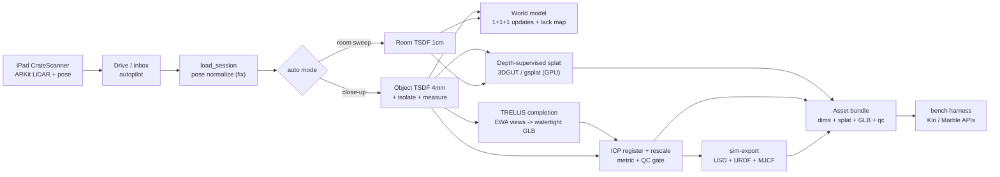

# assetpipe — end-to-end open-source flow map

The whole pipeline at a glance. Statuses as of 2026-07-24 — measured, not projected.
Deep dives: [OBJECT_ASSET_PLAN.md](OBJECT_ASSET_PLAN.md) (staged plan + scorecard),
[PIPELINE.md](PIPELINE.md) (the offline multi-backend refine loop), and the
"iPad RGB-D → 3D Asset Pipeline" artifact page (visual version).

| # | Stage | Tooling (all OSS) | Status · measured result |
|---|-------|-------------------|--------------------------|
| 1 | Capture (iPad ARKit) | ARKit sceneDepth, XcodeGen | Shipped · color still 640px — un-cap needs one rebuild |
| 2 | Ingest / pose normalize | NumPy | **Proven** · apartment 0.8%→2.1% plane, 15.9°→2.6° gravity; objects 36%@0.29°, 65%@0.1° |
| 3 | Route + TSDF fuse | Open3D (MIT) | **Proven** · auto mode + auto voxel (4mm obj / 1cm room); dims agree ~3% with device |
| 4 | World model (1+1+1) | Open3D FPFH+ICP | **Proven** · 25°/1.7m visit offset recovered to 0.25°/1.5cm; lack_map.png; `--world-scene` in the Drive loop |
| 5 | Depth-supervised splat | 3DGUT/gsplat (Apache-2.0) | Queued · GPU driver mismatch; `scripts/gpu_quality_queue.sh` after reboot |
| 6 | Complete & scale | TRELLIS (MIT), SAM 2, Open3D ICP | Partly shipped · EWA renders wired (dots→photo-like); isolation upgrade = Phase 2.5 |
| 7 | Sim export | CoACD (MIT), trimesh, usd-core, MuJoCo | **Proven** · `assetpipe sim-export`; mouse settles in MuJoCo; USD/URDF/MJCF valid |
| 8 | Benchmark loop | tools/bench_* | Built · needs KIRI_API_KEY / WORLDLABS_API_KEY; bench_compare splits scale vs shape error |

Scoreboard vs commercial bars (11-agent graded, adversarially verified): room shell
3→7 (Kiri splat) / 3.5→7.5 (Marble, crediting metric+faithful); raw object 2.5→5;
TRELLIS object 4→6.5; metric honesty 7→9; sim-readiness 4→6.5 (Lightwheel).

Unblocks (user-side): **reboot** (GPU) → `gpu_quality_queue.sh`; **API keys** →
literal Kiri/Marble A/B; **recapture at 1920** after the app fix; **commit**.
