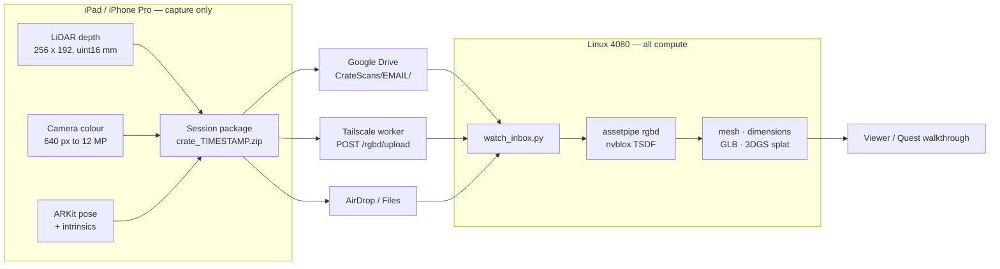
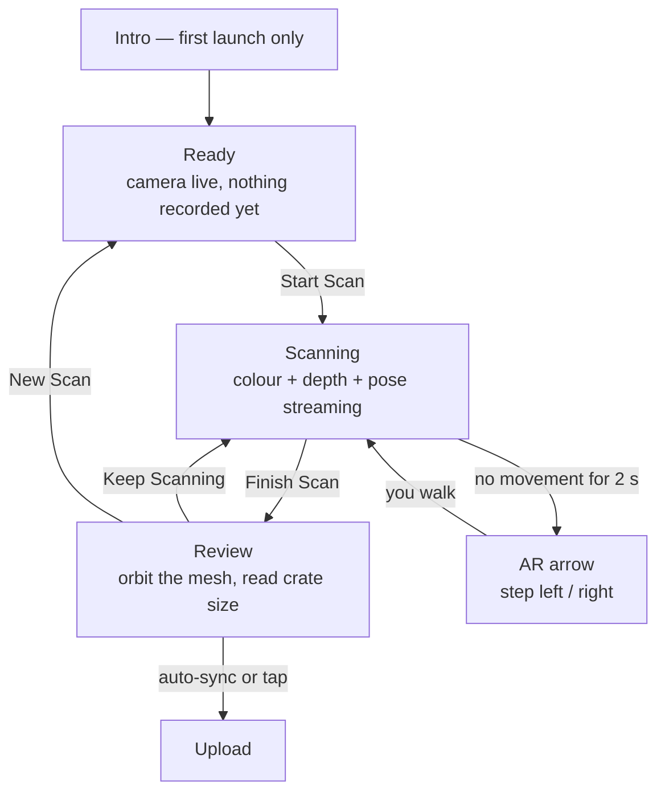
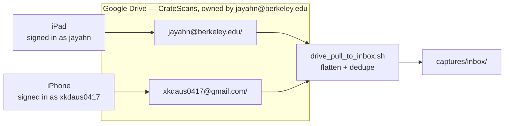

# CrateScanner — what it is, and where it fits

**ENGIN 170 · the iOS half of the 3dasset pipeline**

> One sentence: **CrateScanner is a capture instrument, not a reconstructor.**
> It records what the LiDAR and camera saw, and exactly where the camera was
> when they saw it, then hands that off. Every heavy computation — fusion,
> meshing, texturing, splats — happens on the Linux 4080.

That split is deliberate. An iPad can *scan* far better than it can *compute*:
it has the depth sensor and the tracker, but no CUDA. Trying to fuse on device
would produce a worse asset and a hot, dead battery. So the app's whole job is
to produce a clean, honest recording — and to make the human holding it move
correctly, which turns out to be the hardest part.

---

## Where it sits



The app never talks to nvblox, never opens a mesh it didn't capture, and never
needs the 4080 to be online. Delivery is decoupled: a scan is finished and
safe on disk the moment you tap **Finish**, whatever the network is doing.

---

## What one scan produces

```text
crate_20260806_10_52_18.zip
  README_LINUX.txt            what to run, in the box
  measurement.json            L x W x H + crate size, if you used Measure
  mesh.obj                    on-device LiDAR mesh — a preview, not the asset
  session/
    manifest.json             the part that matters
    images/0000.jpg …         colour stream, throttled to ~10 Hz
    depth/0000.png …          uint16 depth, millimetres, native 256 x 192
    keyframes/k0000.jpg …     12 MP stills, Photo and Detail modes
```

`manifest.json` is what makes the pixels usable. Per frame:

| Field | Meaning |
|---|---|
| `color`, `depth` | paths, relative to `session/` |
| `pose` | 4x4 camera-to-world, row-major, `pose_convention: arkit_gl` |
| `intrinsics` | `[fx, fy, cx, cy]`, already scaled to the **stored** image size |
| `color_size` | the stored resolution, so a later texture pass can do the maths |
| `t` | ARKit timestamp |

Depth stays at the sensor's native resolution on purpose — the trainer should
see the real data and decide, not inherit an upsample the phone invented.

---

## The operator's loop



Every control is a tap. No sliders, no segmented controls to drag, and the only
gesture on the camera view is a single tap — because this gets used one-handed,
walking around a machine.

### The one thing people get wrong

**Standing still.** Fusion works from parallax: the same surface seen from
different angles. A stationary scan streams hundreds of frames and adds no new
information, and the far side of the object is simply never observed. Nothing on
screen used to say so.

So the app watches its own motion. Under ~18 cm of travel and ~15° of turn over
2 seconds while recording, a yellow arrow appears in the AR view pointing along
the orbit — the tangent around whatever you're scanning, in whichever direction
you were already heading — with the same instruction in a banner. It clears once
you've actually moved 30 cm. Thresholds are the four constants at the top of
[`CrateScanner/Support/MoveNudge.swift`](CrateScanner/Support/MoveNudge.swift).

### Capture modes

| Mode | Records | Use when |
|---|---|---|
| **Video** | ~10 Hz colour + depth stream | default — geometry and a quick asset |
| **Photo** | one 12 MP still per shutter tap | you want control over every shot |
| **Detail** | the stream **plus** automatic 12 MP stills | best quality; texturing or photogrammetry later |

Detail's stills only fire when the frame is sharp *and* the device is steady —
ARKit runs the camera for tracking, not photography, so most frames while
walking are motion-blurred. The reticle turns green when a frame would be kept.

**Detail level** (Fast / Balanced / High / 4K) only affects **colour**
resolution. It does not sharpen the geometry: fusion resizes colour down to the
depth resolution anyway. It matters for *texturing*, and for photogrammetry.

---

## Getting scans to Linux

| Route | How | Good for |
|---|---|---|
| **Google Drive** | auto-sync on the review screen | several people, no shared network |
| **Tailscale worker** | "Send to Linux now" → `POST /rgbd/upload` | fastest; needs the tailnet |
| **AirDrop / Files** | "Share elsewhere" | one-off, or when both are down |

### Drive: one shared folder, one subfolder each



Everyone signs in as **themselves**; scans pool in one Drive and stay
attributable. The app finds the core folder **by owner**, not by name alone —
a name-only lookup makes a teammate resolve their own private `CrateScans`,
which looks exactly like success while pooling nothing.

Each person needs three things, and they fail differently:

| Requirement | Where | Symptom if missing |
|---|---|---|
| **Test user** | Cloud Console → OAuth consent screen → Audience | `Error 403: access_denied` at sign-in |
| **Editor** on the core folder | Drive → Share | "Can't see a CrateScans folder owned by …" |
| In `allowedAccounts` | `CrateScanner/Support/GoogleDriveConfig.swift` | amber warning, auto-sync paused |

Full setup notes, including how to point this at a different folder or account,
are in [README.md](README.md#google-drive-destination--one-shared-core-folder).

---

## What Linux does with it

From the [`3dasset`](https://github.com/jayahn17/3dasset) repo, which holds the
pipeline this app feeds:

```bash
# automatic: the timer pulls Drive → inbox, the watcher fuses whatever lands
systemctl --user enable --now rgbd-drive-sync.timer rgbd-watcher

# by hand
unzip crate_20260806_10_52_18.zip -d scan1
python -m assetpipe rgbd scan1/session --inspect-only        # sanity first
python -m assetpipe rgbd scan1/session --backend auto --out demo_out/scan1
python -m assetpipe cratescan scan1 --out demo_out/scan1     # mesh + crate dims
```

`--inspect-only` is worth the ten seconds: it reports frame count, depth
coverage and pose sanity before you spend GPU time on a bad capture.

---

## Building it

```bash
brew install xcodegen        # once
xcodegen generate            # after EVERY pull — new files don't join the target on their own
open CrateScanner.xcodeproj
```

Then **Signing & Capabilities → Team** = your Apple ID, destination = a LiDAR
iPad Pro or iPhone Pro, ⌘R. The `.xcodeproj` is generated and gitignored on
purpose; a hand-maintained one silently drops files that arrive in a pull.

The simulator builds and runs but has no LiDAR, so it shows the unsupported-device
screen. Real scanning needs the hardware.

---

## Known seams

Honest list of what isn't wired yet, so nobody rediscovers it the hard way:

- **`tools/drive_rgbd_autopilot.py` still defaults to the old `engin170_sync`
  folder id**, and globs `CrateScan-*.zip` while the app now names packages
  `crate_<timestamp>.zip`. Use the systemd route above until that's reconciled.
- **A session can finish with zero RGB-D frames** in Video mode — the streaming
  track silently recording nothing. Check the review screen's frame count before
  you walk away; the failure is loud on Linux and invisible on the iPad. Root
  cause and fix are specified in `roomscape/docs/CAPTURE_SPEC.md` in the 3dasset
  repo.
- **The move-nudge thresholds are analytical, not empirical.** They were derived
  from the geometry, not tuned against real scans. Expect to adjust them.
